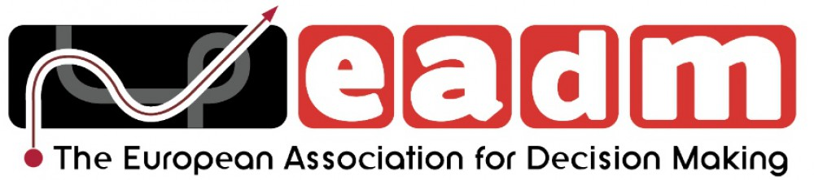

```{=html}
<h1></h1>
```

::: {.eadm-hero}

::: {.eadm-lead}
The European Association for Decision Making (EADM) is an interdisciplinary
organisation dedicated to the study of normative, descriptive, and
prescriptive theories of decision making. It has its origins in a Research
Conference on Subjective Probability, organised in 1969 by Wendt, Stael von
Holstein and Vlek in Hamburg, and was formally founded in August 1993.
:::

::: {.eadm-actions}
[Become a member](membership/index.qmd){.btn .btn-primary}
[SPUDM conference](spudm/index.qmd){.btn .btn-outline-secondary}
:::

:::

## Get involved

:::::: {.eadm-cards}

::: {.eadm-card}
### [About EADM](about/index.qmd)
History, mission, and the Executive Board.
:::

::: {.eadm-card}
### [Membership](membership/index.qmd)
Who can join and how.
:::

::: {.eadm-card}
### [SPUDM](spudm/index.qmd)
The Association's biennial conference.
:::

::: {.eadm-card}
### [Prizes](prizes/index.qmd)
De Finetti, Jane Beattie, and Lifetime Contribution awards.
:::

::: {.eadm-card}
### [Funding](funding/index.qmd)
Travel scholarships, workshop grants, and summer schools.
:::

::: {.eadm-card}
### [News](news/index.qmd)
Announcements and updates from EADM.
:::

::::::
